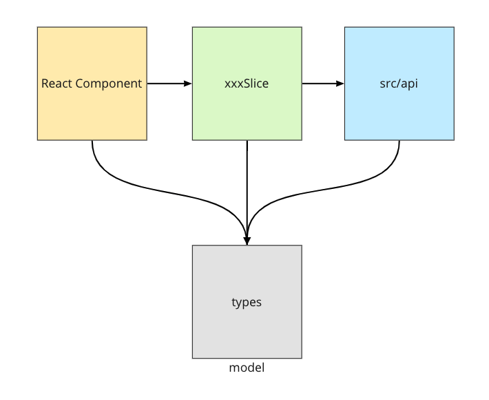
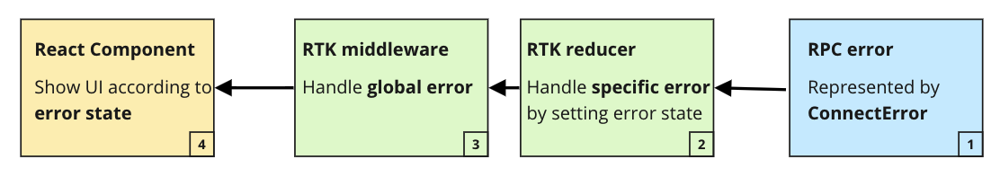
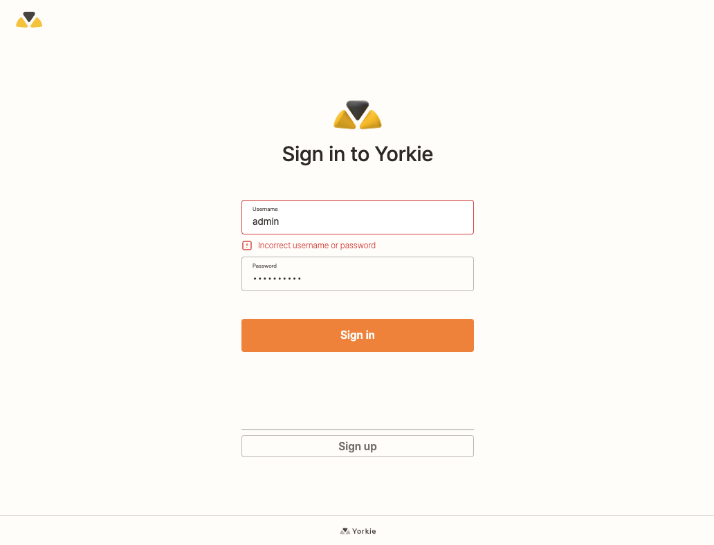
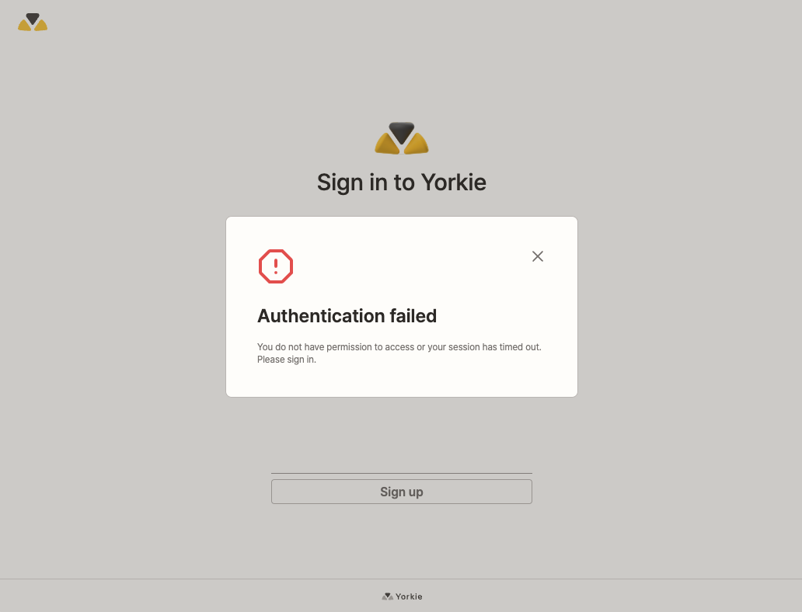

# RPC error handling

## Summary

We implement a custom thunk to handle errors commonly encountered during asynchronous actions. In the `extraReducers` section, we address specific errors for each action, while common errors or other exceptions are managed by the Redux middleware.

### Goals

We handle RPC errors appropriately depending on the situation.

### Non-Goals

This document focuses exclusively on RPC error handling. Rendering errors in components can be handled using error-boundaries or other suitable approaches.

## Proposal Details

#### Dashboard Layered Architecture

Dashboard layered architecture pattern looks like:

- `RC`(presentation): Display that information on a screen in a particular format
- `xxSlice`(business): Perform business logic against the data
- `src/api/index.ts`: RPC Request

As a request moves from layer to layer in the layered architecture, it must go through the layer right below it to get to the next layer below that one.

|                               Dashboard architecture                                |                                                                                                                                         Layered architecture                                                                                                                                         |
| :---------------------------------------------------------------------------------: | :--------------------------------------------------------------------------------------------------------------------------------------------------------------------------------------------------------------------------------------------------------------------------------------------------: |
|  | <br/> [Image - Software Architecture Patterns](https://www.oreilly.com/library/view/software-architecture-patterns/9781491971437/ch01.html) |

#### RPC Error Handling

We manage RPC errors through the following steps:



1. When an RPC request fails, all RPC errors are represented as [ConnectError](https://connectrpc.com/docs/web/errors). We create a custom thunk to handle errors commonly for asynchronous actions. In the code snippet below, when an error occurs, we [handle it using `rejectWithValue`](https://redux-toolkit.js.org/api/createAsyncThunk#handling-thunk-errors). If it's a `ConnectError`, we convert its error code to a string and [decode error details](https://connectrpc.com/docs/web/errors/#error-details).

```ts
// Custom thunk for error handling
export const createAppThunk = <Returned, ThunkArg, ThunkApiConfig extends AsyncThunkConfig = AppThunkConfig>(
  type: string,
  payloadCreator: AsyncThunkPayloadCreator<Returned, ThunkArg>,
): AsyncThunk<Returned, ThunkArg, ThunkApiConfig> => {
  return createAsyncThunk<Returned, ThunkArg, ThunkApiConfig>(type, async (arg: ThunkArg, thunkAPI: any) => {
    try {
      return await payloadCreator(arg, thunkAPI);
    } catch (error: unknown) {
      if (!(error instanceof ConnectError)) {
        return thunkAPI.rejectWithValue({ error }, { isHandledError: false });
      }

      const errorDetails = fromErrorDetails(error);
      // NOTE(chacha912): When handling errors in Redux Toolkit, everything that does not match
      // the SerializedError interface will have been removed from it. So, we need to convert
      // the error.code to string.
      // See https://redux-toolkit.js.org/api/createAsyncThunk#handling-thunk-errors for more details.
      const rpcError = new RPCError(JSON.stringify(error.code), error.message, errorDetails);
      return thunkAPI.rejectWithValue({ error: rpcError }, { isHandledError: false });
    }
  });
};
```

2. Specific RPCErrors are handled by updating the error state in the reducer. Since we handle errors using `rejectWithValue` as described in the first step, you can access the error through `action.payload`. Additionally, we indicate that the error has been handled by setting `action.meta.isHandledError` to true.

```ts
// src/features/users/usersSlice.ts
export const usersSlice = createSlice({
  name: 'users',
  initialState,
  reducers: { ... },
  extraReducers: (builder) => {
    // rejected case
    builder.addCase(loginUser.rejected, (state, action) => {
      state.login.status = 'failed';
      const error = action.payload!.error;
      if (!(error instanceof RPCError)) {
        return;
      }

      const statusCode = Number(error.code);
      if (statusCode === RPCStatusCode.NOT_FOUND || statusCode === RPCStatusCode.UNAUTHENTICATED) {
        // set specific error state
        state.login.error = {
          target: 'username',
          message: 'Incorrect username or password',
        };
        // notify middleware that the error has been handled
        action.meta.isHandledError = true;
      }
  },
});
```

3. Common RPCErrors, such as request timeouts or session expirations, are handled in Redux middleware. By checking `action.meta.isHandledError`, we can skip processing errors that have already been handled in reducers.

```ts
// app/store.ts

export const store = configureStore({
  reducer: {
    // ...set reducer
  },
  middleware: (getDefaultMiddleware) =>
    getDefaultMiddleware({
      serializableCheck: {
        ignoredActionPaths: ['payload.error'],
      },
    }).concat(globalErrorHandler), // Add common RPCError handler
});
```

```ts
// app/middleware.ts

export const globalErrorHandler: Middleware = (store: MiddlewareAPI) => (next) => (action) => {
  const result = next(action);

  // finish dispatching the action
  if (!isRejectedWithValue(action)) return result;
  // skip specific RPCError
  if (action.meta.isHandledError) return result;

  // handle common error
  let { code: statusCode, message: errorMessage } = action.payload.error;
  statusCode = Number(statusCode);

  if (statusCode === RPCStatusCode.UNAUTHENTICATED) {
    store.dispatch(setIsValidToken(false));
    store.dispatch(setGlobalError({ statusCode, errorMessage }));
    return result;
  }
  store.dispatch(setGlobalError({ statusCode, errorMessage }));
  return result;
};
```

4. Display the UI according to the error state. For example, global errors can be shown using an error modal, while specific errors can be highlighted as errors for particular input fields.

|                  Specific Error UI                  |                 Global Error UI                 |
| :-------------------------------------------------: | :---------------------------------------------: |
|  |  |
